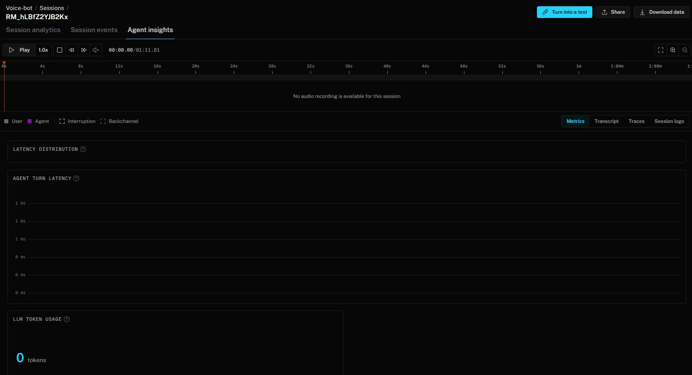
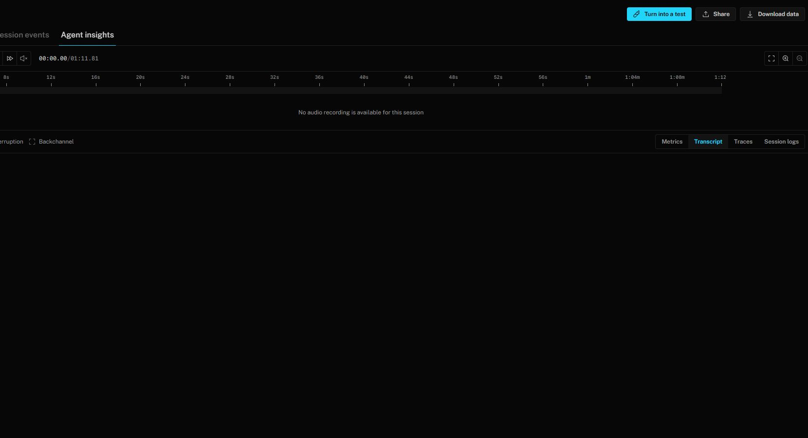

# LiveKit diagnostic screenshots

Captured September 19, 2026 from an earlier LiveKit test attempt. The account sidebar is cropped out for privacy.

These screenshots document an incomplete test attempt, not a successful assessment conversation. The dashboard reports no audio recording for this session, zero LLM tokens, and an empty transcript view.

## Session metrics

## Transcript view

The challenge still requires at least ten full conversations with both sides recorded in OGG or MP3 and accompanying transcripts, actual findings from those calls, and two public applicant webcam videos. These screenshots do not replace those deliverables.
